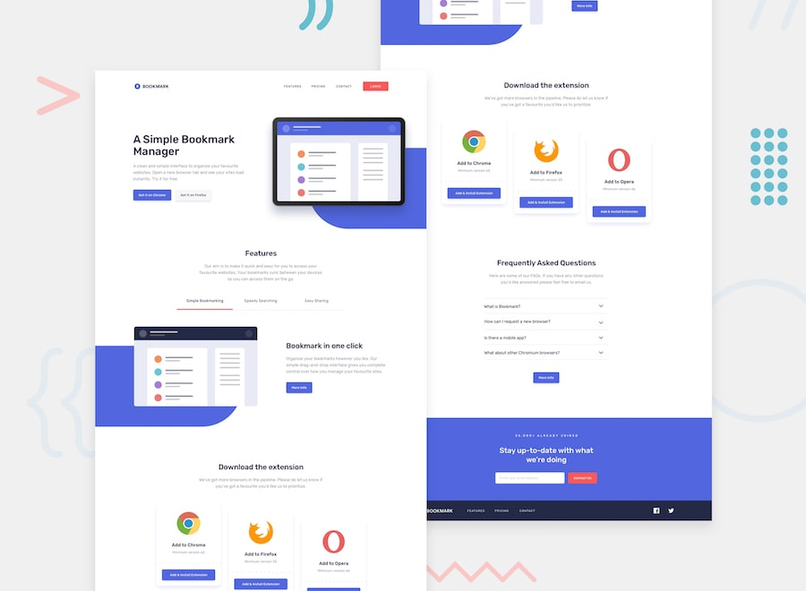

<div align="center">

# 🔖 Bookmark Landing Page

### A fully responsive landing page with tabs, accordion and form validation

[](https://iamsyedbilal.github.io/frontendMentor/bookmark-landing-page/)
[](https://github.com/iamsyedbilal/frontendMentor/tree/main/bookmark-landing-page)



</div>

---

## About

A bookmark manager landing page challenge from Frontend Mentor. Features a tabbed features section, FAQ accordion, custom SVG shape backgrounds, and email form validation — all built with vanilla HTML, CSS and JavaScript.

---

## Features

- ✅ Fully responsive layout — mobile and desktop
- 🗂️ Interactive tabbed features section
- ❓ FAQ accordion with smooth toggle
- 📧 Email form validation with error state
- 🔵 Custom rounded blue background shape with CSS
- 🎨 Hover states on all interactive elements
- ♿ Semantic HTML structure

---

## Built With


---

## What I Learned

- Building a tabbed interface with vanilla JavaScript
- Creating accordion FAQ components
- Email regex validation and error UI states
- Using CSS to create decorative rounded background shapes
- Changing SVG fill and stroke colors dynamically

---

## Run Locally

```bash
git clone https://github.com/iamsyedbilal/frontendMentor.git
cd frontendMentor/bookmark-landing-page
# Open index.html in your browser
```

---

## Acknowledgments

Challenge by [Frontend Mentor](https://www.frontendmentor.io/challenges/bookmark-landing-page-5d0b588a9edda32581d29158)

---

## Author

**Syed Bilal** — [@iamsyedbilal](https://github.com/iamsyedbilal)

[](https://www.frontendmentor.io/profile/iamsyedbilal)

<div align="center"><sub>Built with ❤️ by Syed Bilal</sub></div>
